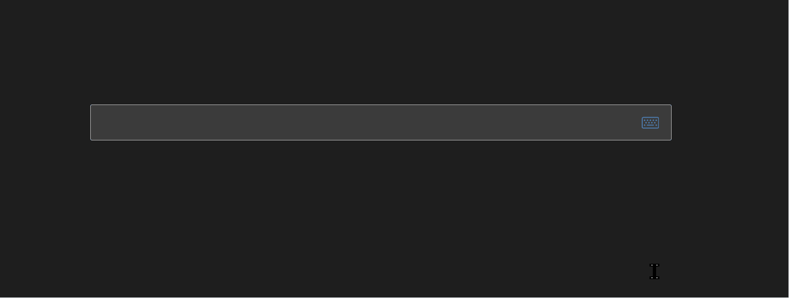

# obsidian-mathlive-codemirror

[Mathlive](https://github.com/arnog/mathlive) input inside the obsidian codemirror editor.

## Feature
- [x] Basic input function
- [x] Toggle mathlive display
- [ ] Switch between mathlive and builtin mathjax
- [ ] Different display modes

## Usage

Edit the equation in mathlive block below the latex display block.

It is also possible to assign a hotkey to toggle the display of mathlive block.

