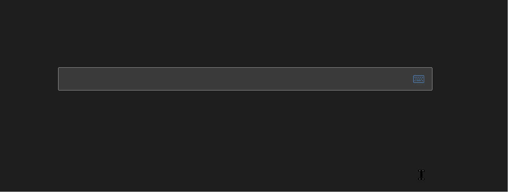

# MathLive in Editor Mode

[MathLive](https://github.com/arnog/mathlive) input in obsidian editor mode.

## Features
- [x] Basic input function
- [x] Toggle mathlive display (global, block or inline)
- [x] Macro (sort of), shortcuts and keybindings support
- [x] Switch between mathlive and builtin mathjax
- [x] Place inline MathLive before or after the source equation
- [ ] Different display modes

## Usage

Edit the equation in mathlive block below the latex display block.

It is also possible to assign a hotkey to toggle the display of mathlive block.

## Macro settings
When the `MathLive macros` setting is set, the new command is available in MathLive widgets but not in builtin mathjax block due to some designs of mathjax.

If you want the new command to also show up in builtin mathjax block, you can use the copy button in `MathLive macros` to copy latex `\newcommand` command, then paste it in mathjax block in every page or use a plugin to preload those new commands.

## Bugfix TODO
- [ ] Input issue in tablet/phone
- [ ] Keep focus and immediate MathJax refresh with the inline MathLive field on the right. The current implementation is experimental and depends on internal editor behavior described below.

The `Inline MathLive position` setting selects `Left` or `Right`. `Left` is the default for compatibility and uses the normal CodeMirror update path. `Right` enables the experimental focus-preservation path.

## Non-public APIs

The plugin currently uses two groups of members that are absent from their public API declarations:

- `src/mathlive-input-sync.ts` writes CodeMirror's private `EditorView.inputState.composing` property around inline MathLive transactions. Public CodeMirror exposes the read-only `EditorView.composing` getter, but does not expose `inputState` or a setter. Access is feature-detected, and the previous value is restored in `finally`.
- `src/setting.ts` uses Obsidian settings internals to open and filter the Hotkeys tab: `app.setting`, `openTabById()`, `activeTab`, `activeTab.headerComponent.components`, and `activeTab.updateHotkeyVisibility()`. These members are absent from the official Obsidian API. The positional component lookup is especially fragile.

No non-public MathLive method is currently called. `window.mathVirtualKeyboard`, Mathfield methods/events, Obsidian `renderMath()`/`finishRenderMath()`, and Obsidian's typed global DOM/string helpers are public APIs. DOM queries, CSS selectors, shadow-DOM access, and DOM mutation are implementation techniques rather than non-public method calls, so they are not classified as non-public APIs here.

After updating Obsidian or CodeMirror, manually verify continuous inline input, focus retention, immediate source/MathJax updates, and the Set hotkey button. `pnpm build` cannot detect private-member changes.
